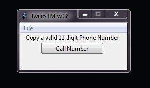

# Twilio FM
[](https://travis-ci.org/joemccann/dillinger)



***Twilio FM*** is a [Twilio][twilurl] python app that allows you to copy any valid telephone number and dial it straight from your personal phone.

  - Copy any String and see if a valid phone number appears
  - Dial the number straight from your personal telephone
  - No more having to manually dial the numbers on your screen!
### Maintainers

[Kevin Gasca][Port] - Software Developer/Maintainer

## Features

- Use any method of Copying Text and see if a valid number can be dialed
- Set your personal information in an easy to configure tfmp.ini file

### Tech

Twilio FM utilizes the following technologies.

| Tech | Website |
|------|------|
| Python 3.7 | https://www.python.org |
| Twilio | https://www.twilio.com |

### Installation
Twilio FM utilizes the Twilio Python helper library. Easily installed using pip.
```sh
pip install twilio
```
If you get the error 'pip: command not found', you can use the 'easy_install' to install the Twilio helper library by running this in your terminal.
```sh
easy_install twilio
```
For a manual installation, you can [download the source code (ZIP)](https://github.com/twilio/twilio-python/zipball/master) for twilio-python and then install the library by running:
```sh
python setup.py install
```

### Development

Want to see this small project make it big! Dope.
Open an [Issue Ticket](https://github.com/GascaK/TwilioFM/issues) and let me know what extra features you'd like to see.
#### Contributing

Even better! 
Take a look at any open issues and let me know if you'd like to assist by making a pull request.

### Todos

 - Write MORE Tests
 - Add Night Mode

License
----

MIT

   [Port]: <https://github.com/GascaK>
   [twilurl]: <https://www.twilio.com/>
